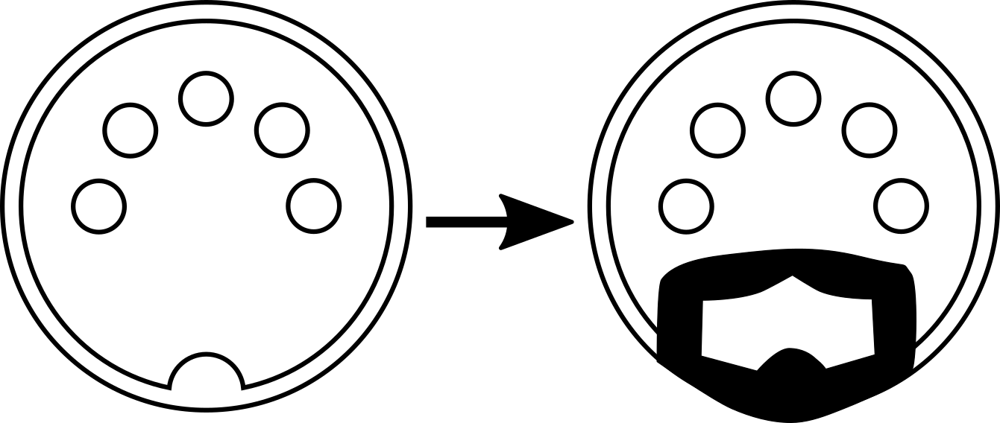

# MIDI "Right to Left"

Pianos and piano-like instruments play higher notes the further right your hands move.  This project provides a
proof-of-concept MIDI passthrough router that sits between a controller and a MIDI receiver and "flips" the notes so
that the further LEFT on keyboard you move, the higher the note.

Notes are shifted so that the keyboard is a mirror image, i.e., what would usually be the "E" key plays a "C", and
what would usually be the "D#" plays a "C#".

## But, why?

Although it has potential as a simple practical joke to set up on someone's machine when they're not looking, I wanted
something that would let me "flip" the direction on [a ribbon controller like this one](http://www.doepfer.de/R2M.htm).

## So, how do I use this?

1. Clone the repo.
2. Run `npm install` from the repository root.
3. Open `index.html` in a browser that supports [the WebMIDI API](https://www.w3.org/TR/webmidi/).
4. Select your MIDI input and output.
5. Play some notes.

The author's suggestion is to try this with a song that's in the key of C.  You won't have to worry about sharps and
flats, the existing tune will be "in key" but will sound very different.

The MIDI connector images used in this package were adapted from
[WikiMedia Commons](https://commons.wikimedia.org/wiki/File:MIDI_connector2.svg) and are provided under the same terms.